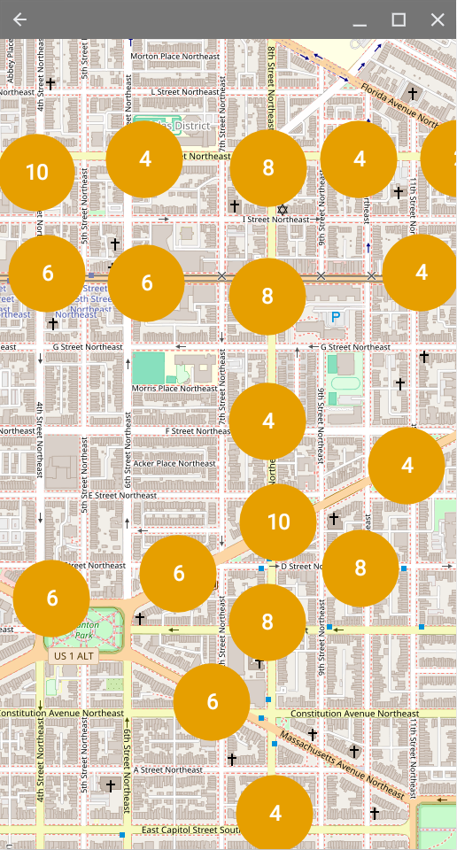

# SimpleTransitApp

A lightweight, privacy-focused Android app for checking real-time transit data.  
Built with OSMDroid, it clusters nearby stops on a map and shows live predictions when you tap on a stop.

 **Key Features**
-  Real-time bus arrivals (currently for the DC area only, powered by WMATA API)
-  Clustered map of stops using open-source tiles (no Google Maps)
-  Colorblind-friendly marker icons
-  Minimal permissions (no tracking or accounts)

**Tech Stack**
- Kotlin
- OSMDroid for map rendering
- osmbonuspack for clustering
- Retrofit for WMATA API calls

 **Current Status**
- Feature-complete MVP
- No ads, no analytics
- Clusters and predictions working
- Preparing for v0.1 release

 **Planned Enhancements**
- Tap-to-zoom refinement on clusters
- Save last viewed map region
- Save favorite stops
- Optional fallback to schedule data if real-time API fails
- Screen-reader-friendly list view
- Localizations to common DC Area languages and others as requested

 **Privacy**
This app does not collect or transmit any personal data. It does not use your location at all - map position is entirely user-selected.

---

## Screenshots

| Clusters on Launch | Real-time Arrivals |
|--------------------|--------------------|
|  |  |

---

##  Build Instructions

1. Clone the repo:

2. Open in Android Studio or build via command line
 
   git clone https://github.com/deangoliath/SimpleTransitApp.git

3. Add your WMATA API key to MainActivity.kt
  
   private val apiKey = "YOUR_API_KEY"

## Credits

    WMATA for the public Bus API

    OSMDroid

    osmbonuspack
